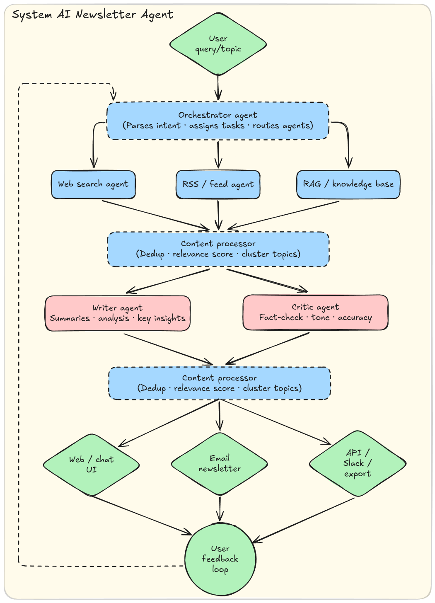

# Good News Agent

A multi-agent news intelligence platform that fetches, filters, scores, fact-checks, and assembles personalized newsletters from web sources and RSS feeds. Built with a Python FastAPI backend, React + Vite frontend, LangGraph orchestration, and local LLM execution via Ollama.

## Workflow Schema



## Features

### Newsletter Generation Pipeline

- **Planner**: Breaks a theme into diverse research angles (breakthroughs, policy, market, research, applications, risks, community impact) using LLM or heuristic fallback
- **Research**: Parallel fan-out per sub-topic, fetching from RSS feeds, Tavily, NewsAPI, and custom URLs
- **Curator**: Scores articles on relevance, recency, credibility, valence (constructive outcomes), and signal (journalistic quality). Blends heuristic + LLM scoring (50/50 for relevance). Cross-subtopic deduplication and source diversity caps
- **Summarizer**: Parallel per-article summarization with quote-verified key facts
- **Fact-checker**: Cross-checks claims and flags conflicts between articles
- **Composer**: Assembles the final newsletter with LLM-written titles, intros, and section blurbs

### Batch Generation & Auto-Delivery

- **One-click batch generation**: Create and execute newsletter runs for all groups simultaneously
- **Auto-theme inference**: Groups without an explicit theme automatically get one inferred from their name
- **Auto-delivery**: Finished newsletters are immediately published to group feeds and emailed to subscribers — no manual send step required
- **Background execution**: Batch runs stream in the background; the admin gets immediate feedback with a status message
- **Run-to-group linking**: Every run is persistently linked to its group, visible in admin history with group name and delivery status badges

### Recurring Schedules (Background Scheduler)

- Create schedules with themes and interval expressions (`hourly`, `daily`, `weekly`, `monthly`, `every Nh`, or cron-like `0 */N * * *`)
- The scheduler polls every 60 seconds and automatically executes due schedules
- Each scheduled run generates a newsletter per theme, links it to the matching group, and auto-delivers to subscribers
- Schedules can be enabled/disabled and deleted from the admin dashboard
- Runs entirely in the background via an asyncio task started on app startup

### User Registration & Groups

- Multi-step registration flow: Welcome → Details → Profile (multi-select questionnaire) → Review → Done
- Users select multiple interests per question and are assigned to matching groups
- Review step shows all selected options and groups before final confirmation
- Admin can create/delete questions and options via the Admin Dashboard
- Each option maps to a group name; users can join multiple groups
- On registration, a secure auth token is generated and stored client-side in localStorage

### Security & Authentication

- **Admin endpoints protected**: All subscriber, group, question, schedule, and run management endpoints require an `X-Admin-Key` header
- **Subscriber tokens**: Registration generates a cryptographically secure token used for authenticated newsletter feed access
- **Token-based feed access**: `/api/newsletters/mine` accepts a subscriber token (preferred) or email (legacy fallback)
- **Unsubscribe mechanism**: Users can self-unsubscribe via `POST /api/unsubscribe` or the unsubscribe link in every email (legal compliance)
- **Unsubscribe page**: Accessible at `/#/unsubscribe?email=...` with a clean, standalone UI

### Newsletter Delivery

- One combined email per subscriber with content from all their groups, sequentially organized with group labels and dividers
- Subscribers in a single group receive the standard newsletter
- Subscribers in multiple groups receive a combined email with all group newsletters
- Email delivery via Resend API or SMTP fallback
- Every email includes a personalized unsubscribe link

### Admin Dashboard

- Pipeline orchestration: trigger newsletter generation runs with configurable themes, audiences, tones, lengths, and curation modes
- **Batch generate**: One-click generation for all groups with auto-theme inference and auto-delivery
- **Schedule management**: Create, toggle, and delete recurring newsletter schedules
- Run history with group name badges, delivery status indicators, and newsletter previews
- Subscriber management with group assignments
- Question & option management (CRUD for registration questionnaire)
- Protected by admin key authentication

### User Portal

- Sign-in modal for returning users (email-based, with token stored for future sessions)
- Registration modal with multi-select checkboxes and review step
- Newsletter browsing with search and filtering
- Personalized "My Newsletters" feed based on group memberships
- Preview/teaser content for non-authenticated visitors
- Self-service unsubscribe page
- Dark mode support

## Architecture

```text
User/Admin (React + Vite)
    |
    v
FastAPI backend
    |
    +--> LangGraph pipeline
    |       +--> Planner (theme -> search angles)
    |       +--> Research (parallel, per angle)
    |       +--> Curator (score, rank, select)
    |       |       +--> widen_queries (retry on thin results)
    |       +--> Summarizer (parallel, per article)
    |       +--> Fact-checker (cross-reference claims)
    |       +--> Composer (assemble newsletter)
    |
    +--> Background Scheduler (asyncio task, 60s poll)
    |       +--> Checks enabled schedules
    |       +--> Executes due schedules (create runs, generate, deliver)
    |
    v
SQLite storage (runs, subscribers, groups, schedules, questions, deliveries)
    |
    v
Email delivery (Resend / SMTP) with unsubscribe links
```

## Scoring System

Articles are scored on five independent axes:

| Axis | Description | Weight (Balanced) |
|------|-------------|-------------------|
| **Relevance** | Theme-specificity with synonym expansion, title/headline/body keyword density, tangential penalties | 0.38 |
| **Recency** | Exponential decay with 7-day half-life | 0.12 |
| **Credibility** | Tiered source reputation (TIER_ONE/TIER_TWO), domain trust markers, HTTPS, content length | 0.15 |
| **Valence** | Constructive outcome detection (positive vs. negative term lexicon) | 0.17 |
| **Signal** | Substantive journalism indicators (data, quotes, methodology) vs. hype/clickbait penalties | 0.18 |

Three curation modes adjust the weights:
- **Balanced**: Default, all axes considered
- **Uplifting**: Higher valence weight for constructive/positive news
- **High Signal**: Higher signal and credibility weight, valence excluded

## Tech Stack

- **Backend**: Python, FastAPI, LangGraph, Pydantic, SQLite (aiosqlite)
- **Frontend**: React, Vite, TypeScript, Tailwind CSS, Framer Motion, Lucide icons
- **LLM**: Ollama (local) with mock provider fallback
- **Search**: Tavily API, NewsAPI, RSS feeds (Google News, BBC, Guardian, NYT, Nature, Science, etc.)
- **Email**: Resend API or SMTP
- **Deployment**: Docker Compose

## Local Development

### Prerequisites

- Python 3.11+
- Node.js 18+
- [Ollama](https://ollama.ai) (for local LLM inference)
- Docker and Docker Compose (optional, for containerized deployment)

### Backend

```bash
cd backend
python -m venv .venv
source .venv/bin/activate
pip install -r requirements-dev.txt
cp .env.example .env
uvicorn app.main:app --reload
```

The API will be available at `http://localhost:8000`.

To test without a local Ollama model:

```bash
LLM_PROVIDER=mock
```

To enable live RSS retrieval, add feed URLs to `backend/.env`:

```bash
RSS_FEEDS=["https://example.com/feed.xml"]
```

### Frontend

```bash
cd frontend
npm install
cp .env.example .env
npm run dev
```

The UI will be available at `http://localhost:5173`.

### Docker Compose

```bash
docker compose up --build
```

This starts:

- FastAPI backend on `http://localhost:8000`
- React + Vite frontend on `http://localhost:5173`
- Ollama on `http://localhost:11434`

After the Ollama container starts, pull a model before using the default provider:

```bash
docker compose exec ollama ollama pull mistral:latest
```

## Configuration

Key environment variables (see `backend/.env.example`):

| Variable | Default | Description |
|----------|---------|-------------|
| `LLM_PROVIDER` | `ollama` | LLM provider (`ollama` or `mock`) |
| `OLLAMA_BASE_URL` | `http://localhost:11434` | Ollama server URL |
| `OLLAMA_MODEL` | `mistral:latest` | Model name |
| `SEARCH_PROVIDERS` | `["auto"]` | Search providers to use |
| `TAVILY_API_KEY` | — | Tavily search API key |
| `NEWSAPI_KEY` | — | NewsAPI key |
| `RESEND_API_KEY` | — | Resend email API key |
| `SMTP_HOST` | — | SMTP server host (fallback for email) |
| `ADMIN_PASSWORD` | `admin123` | Admin dashboard password |
| `SECRET_KEY` | `change-me-in-production` | Secret for signing subscriber tokens |
| `RELEVANCE_THRESHOLD` | `0.30` | Minimum relevance score for article selection |
| `RESULTS_PER_SUBTOPIC` | `20` | Max results to fetch per sub-topic |
| `MAX_SEARCH_ATTEMPTS` | `2` | Retry attempts when results are thin |

## API Endpoints

### Public

| Method | Path | Description |
|--------|------|-------------|
| `GET` | `/api/health` | Health check |
| `POST` | `/api/runs` | Start a newsletter generation run |
| `GET` | `/api/runs` | List recent runs (includes group name, delivery count) |
| `GET` | `/api/runs/{run_id}` | Get run status and newsletter |
| `GET` | `/api/newsletters` | List completed newsletters |
| `GET` | `/api/newsletters/mine` | List newsletters for a subscriber (requires `token` or `email` param) |
| `POST` | `/api/register` | Register a subscriber with questionnaire answers (returns auth token) |
| `POST` | `/api/unsubscribe` | Unsubscribe by email (no auth required) |

### Admin (requires `X-Admin-Key` header)

| Method | Path | Description |
|--------|------|-------------|
| `POST` | `/api/runs/batch/execute` | Create and execute runs for all groups with auto-delivery |
| `POST` | `/api/runs/{run_id}/send` | Send newsletter to group subscribers |
| `GET` | `/api/runs/{run_id}/deliveries` | Check delivery status |
| `GET` | `/api/subscribers` | List subscribers with group memberships |
| `POST` | `/api/subscribers` | Add a subscriber |
| `DELETE` | `/api/subscribers/{id}` | Delete a subscriber |
| `POST` | `/api/subscribers/{id}/groups/{gid}` | Assign subscriber to group |
| `DELETE` | `/api/subscribers/{id}/groups/{gid}` | Remove subscriber from group |
| `GET` | `/api/groups` | List groups |
| `POST` | `/api/groups` | Create a group (with theme) |
| `DELETE` | `/api/groups/{id}` | Delete a group |
| `GET` | `/api/questions` | List registration questions |
| `POST` | `/api/questions` | Create a question with options |
| `DELETE` | `/api/questions/{id}` | Delete a question |
| `GET` | `/api/schedules` | List recurring schedules |
| `POST` | `/api/schedules` | Create a schedule (themes, cron expression, config) |
| `PATCH` | `/api/schedules/{id}` | Enable/disable a schedule |
| `DELETE` | `/api/schedules/{id}` | Delete a schedule |

## Repository Structure

```text
.
├── backend/
│   ├── app/
│   │   ├── api/           # FastAPI routes (runs, auth, health, news)
│   │   ├── core/          # Config and settings
│   │   ├── graph/         # LangGraph pipeline (nodes, scoring, state)
│   │   ├── providers/     # LLM provider abstraction
│   │   ├── search/        # Search provider integrations (RSS, Tavily, NewsAPI)
│   │   └── services/      # Storage, mailer, exporter, scheduler
│   ├── tests/
│   ├── Dockerfile
│   └── pyproject.toml
├── frontend/
│   ├── src/
│   │   ├── components/    # React components (UserView, AdminView, UnsubscribeView, modals)
│   │   ├── services/      # API client
│   │   ├── lib/           # Utilities
│   │   └── styles/        # CSS
│   ├── Dockerfile
│   └── package.json
├── docker-compose.yml
├── README.md
└── medias/
```
