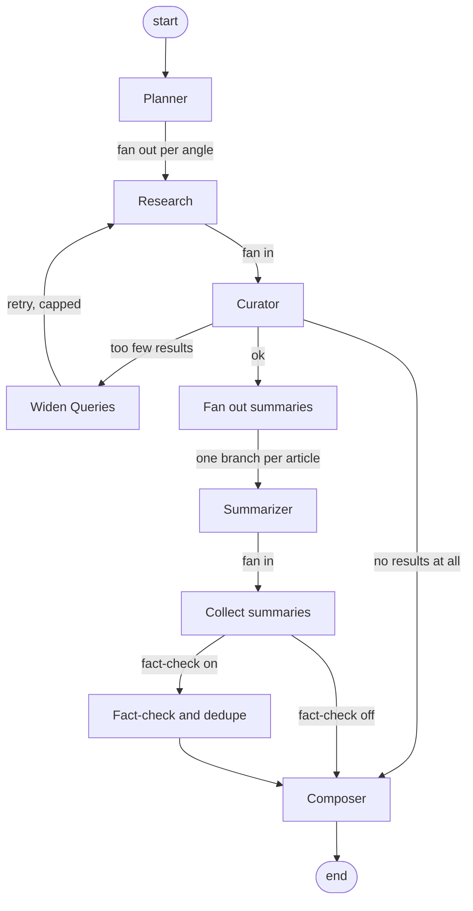

# Architecture

## Why a graph

A newsletter run is not a chain. Several sub-topics are researched at the same
time, several articles are summarised at the same time, and a thin result has to
loop back and search again. Expressing that as a
[LangGraph](https://langchain-ai.github.io/langgraph/) `StateGraph` gives three
things a prompt chain does not:

- **Real parallelism with safe joins.** `Send` fans out one branch per sub-topic
  and per article; typed reducers merge the branches back without clobbering.
- **Conditional control flow.** A retry edge, a skippable fact-check, and a
  degraded path to the composer are edges in the graph, not `if` statements
  buried in a service.
- **Checkpointing.** Every super-step is persisted, so an interrupted run can be
  resumed instead of restarted.

## Topology

`GET /api/graph/topology` serves this to the UI; `python -m app.graph.harness
--print-graph` prints it plus the Mermaid rendering.



## The nodes

| Node | Kind | Job | Fallback when the LLM is unavailable |
|---|---|---|---|
| **Planner** | single | Split a theme into N non-overlapping search angles | A fixed list of angle templates |
| **Research** | parallel | Query every configured provider for one angle | n/a — no model involved |
| **Curator** | single | Score, gate, rank and select | Heuristic scores only |
| **Widen Queries** | retry | Broaden queries and relax the topic gate | n/a — deterministic |
| **Summarizer** | parallel | Headline, bullets and quote-backed facts for one article | First sentences of the article |
| **Fact-check** | conditional | Deduplicate, cross-check claims between sources | Numeric-disagreement heuristic |
| **Composer** | single | Title, intro, section blurbs, outro | Templated copy |

Every node that calls the model does so through `app.graph.llm.try_json`, which
returns `None` on any failure — a bad response, invalid JSON, a schema
violation, or an unreachable daemon. The node then uses its heuristic. This is
what makes the pipeline runnable with `LLM_PROVIDER=mock`, and what keeps a run
from dying because Ollama restarted mid-way.

## State

`app/graph/state.py` defines every hand-off as a Pydantic model. Nothing is
passed between nodes as free text.

```
RunConfig ─▶ SubTopic ─▶ RawArticle ─▶ ScoredArticle ─▶ ArticleSummary ─▶ Newsletter
                                            │                 │
                                       ArticleScores       KeyFact
```

Slots written by parallel branches carry merge reducers, because two branches
completing in the same super-step would otherwise overwrite each other:

| Slot | Reducer | Behaviour |
|---|---|---|
| `raw_articles` | `merge_articles` | Union by article id; on a clash keep the longer body |
| `scored` | `merge_scored` | Later score wins, so a retry supersedes cleanly |
| `summaries` | `merge_summaries` | Later summary wins, keyed by article id |
| `events` / `errors` | `operator.add` | Append-only |

### Article identity

`article_id` hashes a *canonical* URL — lower-cased host, `www.` stripped, no
trailing slash, no query string, no fragment. So
`https://www.example.com/story/?utm_source=x#top` and
`https://example.com/story` are one article, and a story found by three
providers under three tracking URLs is counted once.

## Curation

Five axes, measured independently in `app/graph/scoring.py`:

| Axis | Measures |
|---|---|
| `relevance` | Term overlap with the theme and the angle |
| `recency` | Exponential decay, 7-day half-life |
| `credibility` | Source tier, TLD, HTTPS, body length, presence of a date |
| `goodness_valence` | Is the *outcome* constructive? |
| `goodness_signal` | Is it substantive reporting rather than hype? |

`GoodNewsMode` changes only how these are **weighted**, never how they are
measured — so a run can be re-ranked without re-fetching anything.

When the LLM is available its judgement is blended in at 60% against a 40%
heuristic anchor, so one bad model call cannot dominate the ranking.

### The topicality gate

Blending has a failure mode: a model that scores everything ~0.7 will drag an
unrelated story above the relevance threshold. Observed in practice — a Porsche
review surfacing under "climate technology" because its blurb said "technology".

So topicality is a **hard gate, not a weighted signal**:

- An article must mention the theme's own terms in its **headline or lede**.
  The body is deliberately ignored: a fetched page carries navigation, related
  links and footers, so almost any long page overlaps almost any theme.
- How many terms are required comes from `required_term_count()` — capped by how
  many terms the theme actually has, so a one-word theme requires one, and
  "climate technology" requires both.
- A **widened retry relaxes the requirement to a single term.** The strict first
  pass buys precision; the retry buys back recall. Both passes and the RSS
  prefilter use the same function, so retrieval and selection cannot disagree
  about what "on topic" means.

If a run ends up widening, the newsletter says so in its notes.

## The guarantees

**No invented sources.** The composer receives only `ArticleSummary` objects —
never article bodies — is instructed to emit no links, and has any URL stripped
from its output. Source references are built from the fetched set, not from
model text.

**No unverifiable facts.** The summarizer must attach a verbatim quote to every
key fact. `_verify` normalises whitespace and case, then requires the quote to be
a literal substring of the fetched body. Facts that fail are dropped and counted;
the newsletter reports the count.

**No silent degradation.** `ArticleSummary.summarized_by` and
`ScoredArticle.scored_by` record whether the model or the heuristic produced each
item, `Newsletter.degraded` marks a thin run, and `Newsletter.notes` explains
what happened.

## Layers

```
app/
├── core/         config, logging, pooled HTTP + SSRF guard, TTL cache, text utils
├── providers/    LLM providers behind one Protocol (ollama, mock)
├── search/       search providers behind one Protocol (rss, tavily, newsapi, mock)
├── graph/        the pipeline: state, scoring, nodes, builder, runner, CLI harness
├── services/     store, scheduler, cron, exporter, briefing projection
├── schemas/      request/response models for the briefing API
└── api/          FastAPI routers
```

The dependency direction is strictly downward: `api → services → graph → search
→ core`. `search` must never import from `graph`, which is why the shared text
helpers live in `core/text.py`.

## Performance

- **One pooled HTTP client** for the whole process (`core/http.py`), so TLS and
  TCP setup is paid once rather than per request.
- **Feeds are cached and single-flighted.** The graph runs one research branch
  per sub-topic and each wants the same feeds. Without this, a 4-sub-topic run
  over 8 feeds made 32 identical requests; it now makes 8. Single-flight matters
  because branches run *concurrently*, so plain expiry checking would still
  stampede.
- **Article extraction is cached per URL**, so a story reached from two angles or
  two providers is downloaded once.
- **Outbound fetches are globally bounded** by `MAX_CONCURRENT_FETCHES`.
- **LLM calls are bounded** by `LLM_MAX_CONCURRENCY`.
- **One SQLite connection** in WAL mode, not one per query.

## Storage

Two separate SQLite databases, on purpose:

- `CHECKPOINT_DB` — LangGraph's own checkpointer. Graph super-steps, used for
  resumption. Owned by the framework.
- `RUNS_DB` — the application store: runs, bookmarks, feedback, schedules.

Keeping them apart means the application schema can migrate without touching
framework-owned data.
